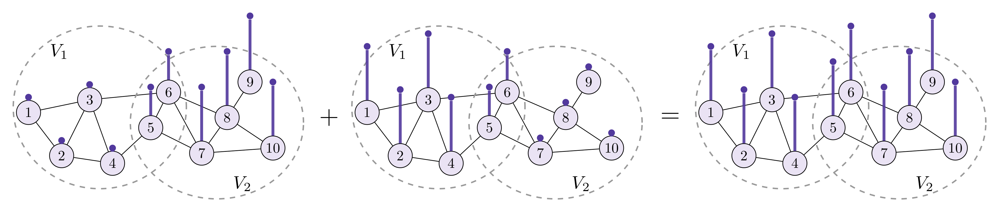
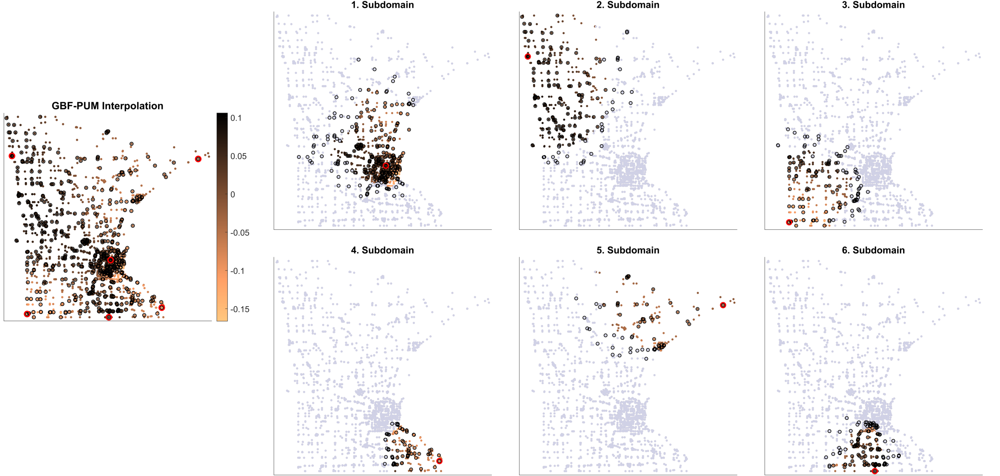

# GBFPUM

A MATLAB Package for Partition of Unity Based Signal Interpolation and Approximation on Graphs

 

 
Fig. 1 Sketch of a Partition of Unity on a simple graph with 10 nodes.

Description of the Code
-----------------------

The package contains several *Matlab* scripts and functions for the generation of a partition of unity on graphs

- The main *Matlab* folder contains example scripts and demos on how to use GBFPUM for the interpolation and regression of graph signals. 

The example scripts can be divided into two categories:

- The files of the form **example.m** are used to demonstrate how GBFs can be used for the interpolation of graph signals and how GBFs compare to bandlimited interpolation.  

 
Fig. 2 GBFPUM interpolation of a signal on the Minnesota graph. 

Citation and Credits
--------------------

If you are using this code, please cite the following article: 

*   [1] &nbsp; Cavoretto, R., De Rossi, A., Erb, W.  
    <i> Partition of Unity Methods for Signal Processing on Graphs </i>  
    J. Fourier Anal. Appl. 27 (2021), Art. 66  

The corresponding theory on GBFs related to kernel-based interpolation of graph signals is given in 

*   [2] &nbsp; Erb, W.  
    <i> Graph Signal Interpolation with Positive Definite Graph Basis Functions  </i>  
    Appl. Comput. Harmon. Anal. 60 (2022), 368-395
 
 

License
-------

Copyright (C) 2022 R. Cavoretto, A. De Rossi, W Erb

GBFPUM is free software: you can redistribute it and/or modify
it under the terms of the GNU General Public License as published by
the Free Software Foundation, either version 3 of the License, or
(at your option) any later version.

This program is distributed in the hope that it will be useful,
but WITHOUT ANY WARRANTY; without even the implied warranty of
MERCHANTABILITY or FITNESS FOR A PARTICULAR PURPOSE.  See the
GNU General Public License for more details.

You should have received a copy of the GNU General Public License
along with this program. If not, see <http://www.gnu.org/licenses/>.
